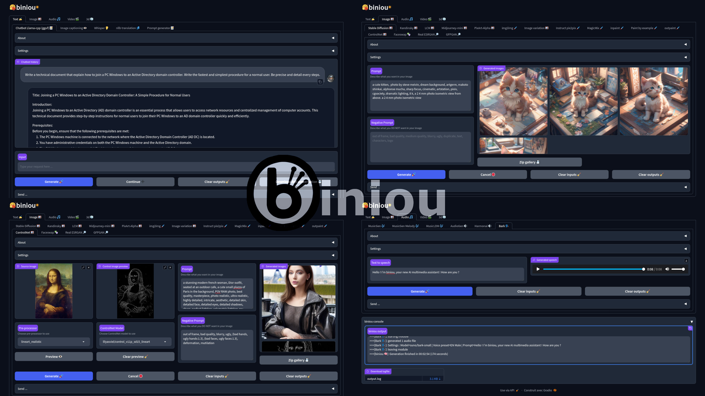

## Home
<h1 align="center">
<p align="center">
  
</p>
</h1>


<p align="justify">biniou is a self-hosted webui for several kinds of GenAI (generative artificial intelligence). You can generate multimedia contents with AI and use a chatbot on your own computer, even without dedicated GPU and starting from 8GB RAM. Can work offline (once deployed and required models downloaded).</p>

<p style="text-align: center;">
<a href="#debian-12--ubuntu-22043--linux-mint-212">GNU/Linux</a> • <a href="#windows-10--windows-11">Windows</a> • <a href="#macos-homebrew-install">macOS (experimental)</a> • <a href="#dockerfile">Docker</a> | <a href="https://github.com/Woolverine94/biniou/wiki">Documentation</a>
</p>

---

## Updates

  * 🆕 **2024-01-26** : ***LoRA models manager module*** : Using this new feature in the Global settings tab, you can now administrate LoRA models directly from biniou's interface.

  * 🆕 **2024-01-25** : ***New Global settings tab*** : You will find in this tab common tools to administrate biniou. First module is the Models cleaner, that allow you to delete unused models to make some space, without having to browse through models and cache directories.

  * 🆕 **2024-01-23** : ***New model for Stable Diffusion-based modules*** : Adding [thibaud/sdxl_dpo_turbo](https://huggingface.co/thibaud/sdxl_dpo_turbo) to Stable Diffusion, img2img and ControlNet module. This interesting model is a merge between SDXL-turbo and SDXL-DPO, the latter being a flavor of SDXL with Direct Preference Optimization training. 

  * 🆕 **2024-01-19** : 🔥 ***New image module : IP-Adapter FaceID*** 🔥 : This module will allow you to extract a face from a single input image and use it as an adapter for your output image. You can see it as a quick'n'easy poor man's replacement for a Dreambooth or LoRA model. 

  * 🆕 **2024-01-18** : 🔥 ***New model for Chatbot module*** 🔥 : Adding model [mlabonne/NeuralBeagle14-7B](https://huggingface.co/mlabonne/NeuralBeagle14-7B) to the Chatbot module. This model, which is a combination of merging models and DPO fine-tuning seems to open a new path for optimizing 7B models and score an honorable 74.74 on the [Open LLM leaderboard](https://huggingface.co/spaces/HuggingFaceH4/open_llm_leaderboard).

[List of archived updates](https://github.com/Woolverine94/biniou/wiki/Updates-archive)

---

## Menu
<p align="left">
  • <a href="#features">Features</a><br/>
  • <a href="#prerequisites">Prerequisites</a><br/>
  • <a href="#installation">Installation</a><br/>
&nbsp;&nbsp;&nbsp;&nbsp;<a href="#debian-12--ubuntu-22043--linux-mint-212">Debian 12 / Ubuntu 22.04.3 / Linux Mint 21.2</a><br/>  
&nbsp;&nbsp;&nbsp;&nbsp;<a href="#windows-10--windows-11">Windows 10 / Windows 11</a><br/>
&nbsp;&nbsp;&nbsp;&nbsp;<a href="#macos-homebrew-install">macOS Homebrew install</a><br/>
&nbsp;&nbsp;&nbsp;&nbsp;<a href="#dockerfile">Dockerfile</a><br/>
  • <a href="#cuda-support">CUDA support</a><br/>
  • <a href="#how-to-use">How To Use</a><br/>
  • <a href="#good-to-know">Good to know</a><br/>
  • <a href="#credits">Credits</a><br/>
  • <a href="#license">License</a><br/>
</p>

---

## Features
* **Text generation using  :**
  - ✍️ [llama-cpp based chatbot module](https://github.com/Woolverine94/biniou/wiki/Chatbot-llama%E2%80%90cpp) (uses .gguf models)
  - 👁️ [Llava 1.5 multimodal chatbot module](https://github.com/Woolverine94/biniou/wiki/Llava-1.5) (uses .gguf models)
  - 👁️ [Microsoft GIT image captioning module](https://github.com/Woolverine94/biniou/wiki/GIT-image-captioning)
  - 👂 [Whisper speech-to-text module](https://github.com/Woolverine94/biniou/wiki/Whisper)
  - 👥 [nllb translation module](https://github.com/Woolverine94/biniou/wiki/nllb-translation) (200 languages)
  - 📝 [Prompt generator](https://github.com/Woolverine94/biniou/wiki/Prompt-generator) (require 16GB+ RAM for ChatGPT output type)

* **Image generation and modification using :**
  - 🖼️ [Stable Diffusion module](https://github.com/Woolverine94/biniou/wiki/Stable-Diffusion)
  - 🖼️ [Kandinsky module](https://github.com/Woolverine94/biniou/wiki/Kandinsky) (require 16GB+ RAM) 
  - 🖼️ [Latent Consistency Models module](https://github.com/Woolverine94/biniou/wiki/Latent-Consistency-Models)
  - 🖼️ [Midjourney-mini module](https://github.com/Woolverine94/biniou/wiki/Midjourney%E2%80%90mini)
  - 🖼️[PixArt-Alpha module](https://github.com/Woolverine94/biniou/wiki/PixArt%E2%80%90Alpha)
  - 🖌️ [Stable Diffusion Img2img module](https://github.com/Woolverine94/biniou/wiki/img2img)
  - 🖌️ [IP-Adapter module](https://github.com/Woolverine94/biniou/wiki/IP%E2%80%90Adapter)
  - 🖼️ [Stable Diffusion Image variation module](https://github.com/Woolverine94/biniou/wiki/Image-variation) (require 16GB+ RAM) 
  - 🖌️ [Instruct Pix2Pix module](https://github.com/Woolverine94/biniou/wiki/Instruct-pix2pix)
  - 🖌️ [MagicMix module](https://github.com/Woolverine94/biniou/wiki/MagicMix)
  - 🖌️ [Stable Diffusion Inpaint module](https://github.com/Woolverine94/biniou/wiki/inpaint)
  - 🖌️ [Fantasy Studio Paint by Example module](https://github.com/Woolverine94/biniou/wiki/Paint-by-Example) (require 16GB+ RAM)
  - 🖌️ [Stable Diffusion Outpaint module](https://github.com/Woolverine94/biniou/wiki/outpaint) (require 16GB+ RAM)
  - 🖼️ [Stable Diffusion ControlNet module](https://github.com/Woolverine94/biniou/wiki/ControlNet)
  - 🖼️ [IP-Adapter FaceID module](https://github.com/Woolverine94/biniou/wiki/IP%E2%80%90Adapter-FaceID)
  - 🎭 [Insight Face faceswapping module](https://github.com/Woolverine94/biniou/wiki/Insight-Face-faceswapping)
  - 🔎 [Real ESRGAN upscaler module](https://github.com/Woolverine94/biniou/wiki/Real-ESRGAN-upscaler)
  - 🔎[GFPGAN face restoration module](https://github.com/Woolverine94/biniou/wiki/GFPGAN-face-restoration)

* **Audio generation using :**
  - 🎶 [MusicGen module](https://github.com/Woolverine94/biniou/wiki/MusicGen)
  - 🎶 [MusicGen Melody module](https://github.com/Woolverine94/biniou/wiki/MusicGen-Melody) (require 16GB+ RAM)
  - 🎶 [MusicLDM module](https://github.com/Woolverine94/biniou/wiki/MusicLDM)
  - 🔊 [Audiogen module](https://github.com/Woolverine94/biniou/wiki/AudioGen) (require 16GB+ RAM)
  - 🔊 [Harmonai module](https://github.com/Woolverine94/biniou/wiki/Harmonai)
  - 🗣️ [Bark module](https://github.com/Woolverine94/biniou/wiki/Bark)

* **Video generation and modification using :**
  - 📼 [Modelscope module](https://github.com/Woolverine94/biniou/wiki/Modelscope-txt2vid) (require 16GB+ RAM)
  - 📼 [Text2Video-Zero module](https://github.com/Woolverine94/biniou/wiki/Text2Video%E2%80%90Zero)
  - 📼 [Stable Video Diffusion module](https://github.com/Woolverine94/biniou/wiki/Stable-Video-Diffusion) (require 16GB+ RAM)
  - 🖌️ [Video Instruct-Pix2Pix module](https://github.com/Woolverine94/biniou/wiki/Video-Instruct%E2%80%90pix2pix) (require 16GB+ RAM)

* **3D objects generation using :**
  - 🧊 [Shap-E txt2shape module](https://github.com/Woolverine94/biniou/wiki/Shap‐E-txt2shape)
  - 🧊 [Shap-E img2shape module](https://github.com/Woolverine94/biniou/wiki/Shap‐E-img2shape) (require 16GB+ RAM)

* **Other features**
  - Communication between modules : send an output as an input to another module
  - Powered by [🤗 Huggingface](https://huggingface.co/) and [gradio](https://www.gradio.app/)
  - Cross platform : GNU/Linux, Windows 10/11 and macOS(experimental, via homebrew)
  - Convenient Dockerfile for cloud instances
  - Support for CUDA on almost all modules (see [CUDA support](#cuda-support))
  - Experimental support for ROCm on almost all modules (see [here](https://github.com/Woolverine94/biniou/wiki/Experimental-features#rocm-support-under-gnulinux))
  - Support for Stable Diffusion SD-1.5, SD-2.1, SD-Turbo, SDXL, SDXL-Turbo,  Segmind SSD-1B and compatible models, through built-in model list or standalone .safetensors files
  - Support for LoRA models
  - Support for Llama, Mistral, Mixtral and compatible quantized models, through built-in model list or standalone .gguf files.
  - Easy copy/paste integration for [TheBloke GGUF quantized models](https://huggingface.co/models?search=TheBloke%20GGUF).


---

## Prerequisites
* **Minimal hardware :**
  - 64bit CPU
  - 8GB RAM
  - Storage requirements :
    - for GNU/Linux : at least 20GB for installation without models.
    - for Windows : at least 30GB for installation without models.
    - for macOS : at least ??GB for installation without models.
  - Storage type : HDD
  - Internet access (required only for installation and models download) : unlimited bandwith optical fiber internet access

* **Recommended hardware :**
  - Massively multicore 64bit CPU
  - 16GB+ RAM
  - Storage requirements :
    - for GNU/Linux : around 200GB for installation including all defaults models.
    - for Windows : around 200GB for installation including all defaults models.
    - for macOS : around ??GB for installation including all defaults models.
  - Storage type : SSD Nvme
  - Internet access (required only for installation and models download) : unlimited bandwith optical fiber internet access

* **Operating system :**
  - a 64 bit OS :
    - Debian 12 
    - Ubuntu 22.04.3 
    - Linux Mint 21.2
    - Windows 10 22H2
    - Windows 11 22H2
    - macOS ???

><u>Note :</u> biniou support Cuda or ROCm but does not require a dedicated GPU to run. You can install it in a virtual machine.

---

## Installation 

### Debian 12 / Ubuntu 22.04.3 / Linux Mint 21.2

  1. **Install** the pre-requisites as root :
```bash
apt install git pip python3 python3-venv gcc perl make ffmpeg openssl
```

  2. **Clone** this repository as user : 
```bash
git clone https://github.com/Woolverine94/biniou.git
```

  3. **Launch** the installer :
```bash
cd ./biniou
./install.sh
```

  4. (optional, but highly recommended) **Install** TCMalloc as root to optimize memory management :
```bash
apt install google-perftools
```


### Windows 10 / Windows 11

Windows installation has more prerequisites than GNU/Linux one, and requires following softwares (which will be installed automatically) : 
  - Git 
  - Python 
  - OpenSSL
  - Visual Studio Build tools
  - Windows 10/11 SDK
  - Vcredist
  - ffmpeg
  - ... and all their dependencies.

<p align="justify">It's a lot of changes on your operating system, and this <b>could potentially</b> bring unwanted behaviors on your system, depending on which softwares are already installed on it.</br>

⚠️ You should really make a backup of your system and datas before starting the installation process. ⚠️ 
</p>

  - **Download and execute**  : [biniou_netinstall.exe](https://github.com/Woolverine94/biniou/raw/main/win_installer/biniou_netinstall.exe)<br/> 

***<p align=left>OR</p>***
  - **Download and execute**  : [install_win.cmd](https://raw.githubusercontent.com/Woolverine94/biniou/main/install_win.cmd) *(right-click on the link and select "Save Target/Link as ..." to download)*<br/>

All the installation is automated, but Windows UAC will ask you confirmation for each software installed during the "prerequisites" phase. You can avoid this by running the choosen installer as administrator.

### macOS Homebrew install

⚠️ Homebrew install is ***theoretically*** compatible with macOS, but has not been tested. Use at your own risk. Any feedback on this procedure through discussions or an issue ticket will be really appreciated. ⚠️

  1. **Install** [Homebrew](https://brew.sh/) for your operating system
 
  2. **Install** required homebrew "bottles" : 
```bash
brew install git python3 gcc gcc@11 perl make ffmpeg openssl
```

  3. **Install** python virtualenv : 
```bash
python3 -m pip install virtualenv
```

  4. **Clone** this repository as user : 
```bash
git clone https://github.com/Woolverine94/biniou.git
```

  5. **Launch** the installer :
```bash
cd ./biniou
./install.sh
```

### Dockerfile

*These instructions assumes that you already have a configured and working docker environment.*

  1. **Create** the docker image :
```bash
docker build -t biniou https://github.com/Woolverine94/biniou.git
```
 
  2. **Launch** the container : 
```bash
docker run -it --restart=always -p 7860:7860 \
-v biniou_outputs:/home/biniou/biniou/outputs \
-v biniou_models:/home/biniou/biniou/models \
-v biniou_cache:/home/biniou/.cache/huggingface \
-v biniou_gfpgan:/home/biniou/biniou/gfpgan \
biniou:latest
```

 3. **Access** the webui by the url :<br/>
[https://127.0.0.1:7860](https://127.0.0.1:7860) or [https://127.0.0.1:7860/?__theme=dark](https://127.0.0.1:7860/?__theme=dark) for dark theme (recommended) <br/>
... or replace 127.0.0.1 by ip of your container

><u>Note :</u> to save storage space, the previous container launch command defines common shared volumes for all biniou containers and ensure that the container auto-restart in case of OOM crash. Remove `--restart` and `-v` arguments if you didn't want these behaviors.<br/>

---

## CUDA support

biniou is natively cpu-only, to ensure compatibility with a wide range of hardware, but you can easily activate CUDA support through Nvidia CUDA (if you have a functionnal CUDA 12.1 environment) or AMD ROCm (if you have a functionnal ROCm 5.6 environment) by running :

  - `update_cuda.sh` if you are a GNU/Linux user with a Nvidia GPU
  - `update_rocm.sh` if you are a GNU/Linux user with an AMD GPU (experimental)
  - `update_win_cuda.cmd` if you are a Windows user

You must now always update biniou using these CUDA updates scripts, as the standards updates scripts will do a rollback to the cpu-only PyTorch version.

Currently, all modules except Chatbot, Llava 1.5 and faceswap modules, could benefits from CUDA optimization.

---

## How To Use

  1. **Launch** by executing from the biniou directory :
  - **for GNU/Linux :**
```bash
cd /home/$USER/biniou
./webui.sh
```
  - **for Windows :**

<p align="justify">Double-click <b>webui.cmd</b> in the biniou directory (C:\Users\%username%\biniou\). When asked by the UAC, configure the firewall according to your network type to authorize access to the webui

><u>Note :</u> First start could be very slow on Windows 11 (comparing to others OS).

  2. **Access** the webui by the url :<br/>
[https://127.0.0.1:7860](https://127.0.0.1:7860) or [https://127.0.0.1:7860/?__theme=dark](https://127.0.0.1:7860/?__theme=dark) for dark theme (recommended) <br/>
You can also access biniou from any device (including smartphones) on the same LAN/Wifi network by replacing 127.0.0.1 in the url with biniou host ip address.<br/>

  3. **Quit** by using the keyboard shortcut CTRL+C in the Terminal

  4. **Update** this application (biniou + python virtual environment) by running from the biniou directory : 

  - **for GNU/Linux :** `./update.sh` (or `./update_cuda.sh` if you're using CUDA)

  - **for Windows** : double-click `update_win.cmd` (or `update_win_cuda.cmd` if you're using CUDA)

---

## Good to know

* Most frequent cause of crash is not enough memory on the host. Symptom is biniou program closing and returning to/closing the terminal without specific error message. You can use biniou with 8GB RAM, but 16GB at least is recommended to avoid OOM (out of memory) error. 

* biniou use a lot of differents AI models, which requires a lot of space : if you want to use all the modules in biniou, you will need around 150GB of disk space only for the default model of each module. Models are downloaded on the first run of each module or when you select a new model in a module and generate content. Models are stored in the directory /models of the biniou installation. Unused models could be deleted to save some space. 

* ... consequently, you will need a fast internet access to download models.

* A backup of every content generated is available inside the /outputs directory of the biniou folder.

* biniou natively only rely on CPU for all operations. It use a specific CPU-only version of PyTorch. The result is a better compatibility with a wide range of hardware, but degraded performances. Depending on your hardware, expect slowness. See [here](#cuda-support) for Nvidia CUDA support and AMD ROCm experimental support (GNU/Linux only).

* Defaults settings are selected to permit generation of contents on low-end computers, with the best ratio performance/quality. If you have a configuration above the minimal settings, you could try using other models, increase media dimensions or duration, modify inference parameters or others settings (like token merging for images) to obtain better quality contents.

* biniou is licensed under GNU GPL3, but each model used in biniou has its own license. Please consult each model license to know what you can and cannot do with the models. For each model, you can find a link to the huggingface page of the model in the "About" section of the associated module.

* Don't have too much expectations : biniou is in an early stage of development, and most open source software used in it are in development (some are still experimentals).

* Every biniou modules offers 2 accordions elements **About** and **Settings** :
  - **About** is a quick help features that describes the module and give instructions and tips on how to use it.
  - **Settings** is a panel setting specific to the module that let you configure the generation parameters.

---

## Credits

This application uses the following softwares and technologies :

- [🤗 Huggingface](https://huggingface.co/) : Diffusers and Transformers libraries and almost all the generatives models.
- [Gradio](https://www.gradio.app/) : webUI
- [llama-cpp-python](https://github.com/abetlen/llama-cpp-python) : python bindings for llama-cpp
- [Llava 1.5](https://llava-vl.github.io/)
- [BakLLava](https://github.com/SkunkworksAI/BakLLaVA)
- [Microsoft GIT](https://github.com/microsoft/GenerativeImage2Text) : Image2text
- [Whisper](https://openai.com/research/whisper) : speech2text
- [nllb translation](https://ai.meta.com/research/no-language-left-behind/) : language translation
- [Stable Diffusion](https://stability.ai/stable-diffusion) : txt2img, img2img, Image variation, inpaint, ControlNet, Text2Video-Zero, img2vid
- [Kandinsky](https://github.com/ai-forever/Kandinsky-2) : txt2img
- [Latent consistency models](https://github.com/luosiallen/latent-consistency-model) : txt2img
- [PixArt-Alpha](https://pixart-alpha.github.io/) : PixArt-Alpha
- [IP-Adapter](https://ip-adapter.github.io/) : IP-Adapter img2img
- [Instruct pix2pix](https://www.timothybrooks.com/instruct-pix2pix) : pix2pix
- [MagicMix](https://magicmix.github.io/) : MagicMix
- [Fantasy Studio Paint by Example](https://github.com/Fantasy-Studio/Paint-by-Example) : paintbyex
- [Controlnet Auxiliary models](https://github.com/patrickvonplaten/controlnet_aux) : preview models for ControlNet module
- [Insight Face](https://insightface.ai/) : faceswapping
- [Real ESRGAN](https://github.com/xinntao/Real-ESRGAN) : upscaler
- [GFPGAN](https://github.com/TencentARC/GFPGAN) : face restoration
- [Audiocraft](https://audiocraft.metademolab.com/) : musicgen, musicgen melody, audiogen
- [MusicLDM](https://musicldm.github.io/) : MusicLDM
- [Harmonai](https://www.harmonai.org/) : harmonai
- [Bark](https://github.com/suno-ai/bark) : text2speech
- [Modelscope text-to-video-synthesis](https://modelscope.cn/models/damo/text-to-video-synthesis/summary) : txt2vid
- [Open AI Shap-E](https://github.com/openai/shap-e) : txt2shape, img2shape
- [compel](https://github.com/damian0815/compel) : Prompt enhancement for various `StableDiffusionPipeline`-based modules
- [tomesd](https://github.com/dbolya/tomesd) : Token merging for various `StableDiffusionPipeline`-based modules
- [Python](https://www.python.org/) 
- [PyTorch](https://pytorch.org/)
- [Git](https://git-scm.com/) 
- [ffmpeg](https://ffmpeg.org/)

... and all their dependencies

---

## License

GNU General Public License v3.0

---

> GitHub [@Woolverine94](https://github.com/Woolverine94) &nbsp;&middot;&nbsp;