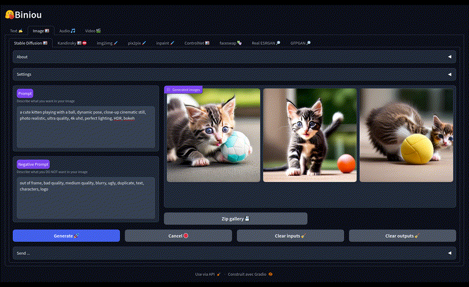

<h1 align="center">
  <br>
  biniou
  <br>
</h1>

<p align="center">
  
</p>

<p align="justify">biniou is a self-hosted webui for several kinds of GenAI (generative artificial intelligence). You can generate multimedia contents with AI and use chatbot on your own computer, even without dedicated GPU and starting from 8GB RAM. Can work offline (once deployed and required models downloaded).</p>


## Menu
<p align="left">
  • <a href="#features">Features</a><br/>
  • <a href="#prerequisites">Prerequisites</a><br/>
  • <a href="#installation">Installation</a><br/>
  • <a href="#how-to-use">How To Use</a><br/>
  • <a href="#good-to-know">Good to know</a><br/>
  • <a href="#credits">Credits</a><br/>
  • <a href="#license">License</a><br/>
</p>


## Features
* **Text generation using  :**
  - llama-cpp based chatbot (uses .gguf models)
  - Microsoft GIT image captioning
  - Whisper speech-to-text
  - nllb translation (200 languages)

* **Image generation and modification using :**
  - Stable Diffusion
  - Kandinsky (require 16GB+ RAM) 
  - Stable Diffusion Img2img
  - Instruct Pix2Pix
  - Stable Diffusion Inpaint
  - Stable Diffusion ControlNet
  - Insight Face faceswapping 
  - Real ESRGAN upscaler
  - GFPGAN face restoration

* **Audio generation using :**
  - Musicgen
  - Audiogen (require 16GB+ RAM)
  - Harmonai
  - Bark text-to-speech 

* **Video generation using :**
  - Modelscope (require 16GB+ RAM)
  - Text2Video-Zero

* **Other features**
  - Communication between modules : send an output as an input to another module
  - Change your model by a simple dropdown menu or download and add it manually 
  - Based on Huggingface 🤗 and gradio
  - Cross platform (to be done)


## Prerequisites
* **Hardware minimal :**
  - 64bit CPU
  - 8GB RAM
  - Storage requirements :
    - for Linux : at least 20GB for installation without models.
    - for Windows : at least 30GB for installation without models.
  - Storage type : SSD (HDD has not been tested)
  - Internet access : unlimited bandwith fiber optic internet access

* **Hardware recommended :**
  - Massively multicore 64bit CPU
  - 16GB+ RAM
  - Storage requirements :
    - for Linux : around 100GB for installation including all defaults models.
    - for Windows : around 100GB for installation including all defaults models.
  - Storage type : SSD Nvme
  - Internet access : unlimited bandwith fiber optic internet access

* **Operating system :**
  - a 64 bit OS :
    - Debian 12 
    - Ubuntu 22.04.3 
    - Windows 10 22H2
    - Windows 11 22H2

> Note : biniou does not support Cuda or ROCm and though does not need a dedicated GPU to run. You can install it in a virtual machine. 


## Installation 

⚠️ As biniou is still in an early stage of development, it is **highly recommended** to install it in an "expendable" virtual machine ⚠️


### Debian 12 /  Ubuntu 22.04

  1. **Install** the pre-requisites as root :
```bash
apt install git pip python3 python3-venv gcc perl make ffmpeg openssl
```

  2. **Clone** this repository as user : 
```bash
git clone https://github.com/Woolverine94/biniou.git
```

  3. **Access** the directory and launch the installer :
```bash
cd ./biniou
./install.sh
```

### Windows 10 / Windows 11

Windows installation has a lot more prerequisites than linux one, and requires following softwares (that will be installed automatically during the install process) : 
  - Git 
  - Python 
  - OpenSSL
  - Visual Studio Build tools
  - Windows 10/11 SDK
  - Vcredist x86/64
  - ... and all their dependencies.

<p align="justify">It's a lot of changes for your operating system, and <b>could potentially</b> bring unwanted behaviors on your system, depending on which softwares are already installed on it.</br></br>
⚠️ You should really considers installing biniou inside a virtual machine, using a dedicated fresh install, or, at least, make a backup of your system and datas before starting the installation process. ⚠️ 
</p>

  1. **Download** [wget](https://eternallybored.org/misc/wget/) for windows :<br/> 
[https://eternallybored.org/misc/wget/1.21.4/64/wget.exe](https://eternallybored.org/misc/wget/1.21.4/64/wget.exe)<br/> 
>Note : **DO NOT** move wget from your default downloads folder, it will be used by the install script and is expected to be in the same directory.

  2. **Download and execute** from your default downloads folder :<br/> 
    **for Windows 10 :** [install_win10.cmd](https://raw.githubusercontent.com/Woolverine94/biniou/main/install_win10.cmd)<br/> 
    **for Windows 11 :** [install_win11.cmd](https://raw.githubusercontent.com/Woolverine94/biniou/main/install_win11.cmd)<br/> 
(right-click on the link and select "Save Target/Link as ..." to download)</br>
All the installation is automated, but Windows UAC will ask you confirmation for each software installed during the "prerequisites" phase. 


## How To Use

  1. **Launch** by executing from the biniou directory (/home/$USER/biniou) : 

  **-for Linux :** 
```bash
./webui.sh
```
  **-for Windows :**
<p align="justify">Double-click <b>webui.cmd</b> in the biniou directory (C:\Users\%username%\biniou\). When asked by the UAC, configure the firewall according to your network type to authorize access to the webui

>Note : First launch could be very slow on Windows 11 (comparing to others OS).

  2. **Access** the webui by the url :<br/>
[https://127.0.0.1:7860](https://127.0.0.1:7860) or [https://127.0.0.1:7860/?__theme=dark](https://127.0.0.1:7860/?__theme=dark) for dark theme (recommended) <br/>

- You can also access biniou from any device (including smartphone) on the same LAN/Wifi network of the biniou host using : <br/>
https://<biniou_host_ip>/ or https://<biniou_host_ip>/?__theme=dark

 3. **Quit** by using the keyboard shortcut CTRL+C in the Terminal

 4. **Update** this application (biniou + python virtual environment) by running from the biniou directory : 

  **-for Linux :**
```bash
./update.sh
```

  **-for Windows, double-click update_win.cmd** 

## Good to know

- Most frequent cause of crash is not enough memory on the host. Symptom is biniou program closing and returning to/closing the terminal without specific error message. You can use biniou with 8GB RAM, but 16GB at least is recommended to avoid OOM (out of memory) error. 

- biniou use a lot of differents AI models, which requires a lot of space : if you want to use all the modules in biniou, you will need around 100GB of disk space only for the default model of each module. Models are downloaded on the first run of each module or when you select a new model in a module and generate content. Models are stored in the directory /models of the biniou installation. Unused models could be deleted to save some space. 

- Consequently, you will need a fast internet access to download models.

- A backup of every content generated is available inside the /outputs directory of the biniou folder.

- biniou doesn't still use CUDA and only rely on CPU for all operations. It use a specific CPU-only version of pyTorch. The result is a better compatibility with a wide range of hardware, but degraded performances. Depending on your hardware, expect slowness. 

- Defaults settings are selected to permit generation of contents on low-end computers, with the best ratio performance/quality. If you have a configuration above the minimal settings, you could try using other models, increase media dimensions or duration, modify inference parameters or others settings (like token merging for images) to obtain better quality contents.

- biniou is licensed under GNU GPL3, but each model used in biniou has its own license. Please consult each model license to know what you can and cannot do with the models. For each model, you can find a link to the huggingface page of the model in the "About" section of the associated module.

- Don't have too much expectations : biniou is in an early stage of development, and most open source software used in it are in development (some are still experimentals).


## Credits

This application uses the following technologies :

(to be done)


## License

GNU General Public License v3.0

---

> GitHub [@Woolverine94](https://github.com/Woolverine94) &nbsp;&middot;&nbsp;
