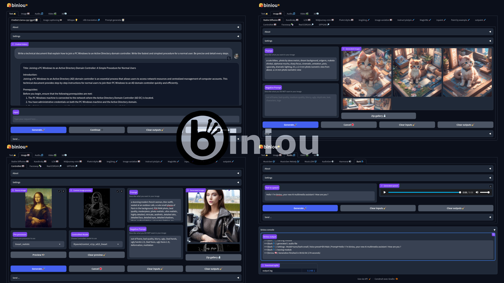

## Home
<h1 align="center">
<p align="center">
  
</p>
</h1>


<p align="justify">biniou is a self-hosted webui for several kinds of GenAI (generative artificial intelligence). You can generate multimedia contents with AI and use a chatbot on your own computer, even without dedicated GPU and starting from 8GB RAM. Can work offline (once deployed and required models downloaded).</p>

<p align="center">
<a href="#GNULinux">GNU/Linux</a> [ <a href="#OpenSUSE-Leap-155--OpenSUSE-Tumbleweed">OpenSUSE base</a> | <a href="#Rocky-93--Alma-93--CentOS-Stream-9">RHEL base</a> | <a href="#debian-12--ubuntu-22043--ubuntu-2404--linux-mint-212">Debian base</a> ] • <a href="#windows-10--windows-11">Windows</a> • <a href="#macos-intel-homebrew-install">macOS Intel (experimental)</a> • <a href="#dockerfile">Docker</a></br>
<a href="https://github.com/Woolverine94/biniou/wiki">Documentation ❓</a> | <a href="https://github.com/Woolverine94/biniou/wiki/Showroom">Showroom 🖼️</a>
</p>

---

<p align="center">⚠️ To anyone who wants to contribute to this project : please note that PR for typos, grammar, mispelled words in documentation/README.md and code not significantly contributing to the project won't be taken into account anymore and will be rejected as there's way too much of them. ⚠️<br /><br />I'm bad at writing a fluent and correct English : deal with it ! </p>

---

## Updates

  * 🆕 **2024-10-19** : 🔥 ***This week's updates*** 🔥 >
    - Add support for SDXL anime model [Bakanayatsu/ponyDiffusion-V6-XL-Turbo-DPO](https://hf.co/Bakanayatsu/ponyDiffusion-V6-XL-Turbo-DPO) and SDXL model [comin/IterComp](https://hf.co/comin/IterComp).
    - Add support for SDXL "Sliders" LoRA models [LyliaEngine/add-detail-xl](https://hf.co/LyliaEngine/add-detail-xl), [ntc-ai/SDXL-LoRA-slider.pixar-style](https://hf.co/ntc-ai/SDXL-LoRA-slider.pixar-style) and [ntc-ai/SDXL-LoRA-slider.Studio-Ghibli-style](https://hf.co/ntc-ai/SDXL-LoRA-slider.Studio-Ghibli-style).
    - Code enhancement for Photobooth module.
    - Bugfixes for critical errors in install scripts.

  * 🆕 **2024-10-19** : 🔥 ***Installer bugfix and re-enabling audiocraft*** 🔥 >
Audiocraft is usable again, bugfix for dependencies hell at installation time and bugfix for huggingface_hub error at startup.

  * 🆕 **2024-10-18** : 🔥 ***Disabling audiocraft-based modules*** 🔥 >
I had to disable audiocraft as it was breaking the installer -but not the updater- by introducing a "pip's dependencies hell" (see this [issue](https://github.com/facebookresearch/audiocraft/issues/493)). I'll try my best to fix it, but it's unlikely that audiocraft will be reintroduced in biniou. Consequently, Musicgen, Musicgen Melody and Audiogen modules are not usable anymore.

  * 🆕 **2024-10-12** : 🔥 ***This week's updates*** 🔥 >
    - Introducing a new "Sliders" category in LoRA models lists, for both SDXL and SD 1.5. Also modifying LoRA weight sliders to support negative values.
    - Support for Chatbot model [bartowski/Tiger-Gemma-9B-v3-GGUF](https://hf.co/bartowski/Tiger-Gemma-9B-v3-GGUF).
    - Add support for SDXL models [stablediffusionapi/protovision-xl-high-fidel](https://hf.co/stablediffusionapi/protovision-xl-high-fidel) and Anime SDXL model [GraydientPlatformAPI/geekpower-cellshade-xl](https://hf.co/GraydientPlatformAPI/geekpower-cellshade-xl) to Stable Diffusion-based modules.
    - Add support for SDXL LoRA models [IcelosAI/Spacephoto_LORA_XL_Base](https://hf.co/IcelosAI/Spacephoto_LORA_XL_Base), [TheLastBen/Papercut_SDXL](https://hf.co/TheLastBen/Papercut_SDXL), [mnemic/MinionStyleXL-SDXL-LoRA](https://hf.co/mnemic/MinionStyleXL-SDXL-LoRA) and SD 1.5 LoRA model [mnemic/MinionStyle-SD1.5-LoRA](https://hf.co/mnemic/MinionStyle-SD1.5-LoRA).
    - Bugfix for a critical error at startup introduced by the latest Transformers update.

  * 🆕 **2024-10-05** : 🔥 ***This week's updates*** 🔥 >
    - Support for Chatbot specialized model [bartowski/Llama-3.1-WhiteRabbitNeo-2-8B-GGUF](https://hf.co/bartowski/Llama-3.1-WhiteRabbitNeo-2-8B-GGUF), model [bartowski/OLMoE-1B-7B-0924-Instruct-GGUF](https://hf.co/bartowski/OLMoE-1B-7B-0924-Instruct-GGUF), and update of model [Orenguteng/Llama-3.1-8B-Lexi-Uncensored-V2-GGUF](https://hf.co/Orenguteng/Llama-3.1-8B-Lexi-Uncensored-V2-GGUF).
    - Add support for SDXL model [OnomaAIResearch/Illustrious-xl-early-release-v0](https://hf.co/OnomaAIResearch/Illustrious-xl-early-release-v0) and fast SDXL model [John6666/jib-mix-realistic-xl-v15-maximus-sdxl](https://hf.co/John6666/jib-mix-realistic-xl-v15-maximus-sdxl) to Stable Diffusion-based modules.
    - Add support for SDXL model [diffusers/sdxl-instructpix2pix-768](https://hf.co/diffusers/sdxl-instructpix2pix-768) to Instruct pix2pix module.
    - Add support for Whisper models [distil-whisper/distil-large-v3](https://hf.co/distil-whisper/distil-large-v3) and [openai/whisper-large-v3-turbo](https://hf.co/openai/whisper-large-v3-turbo) to Whisper module.
    - Support for SDXL LoRA model [nerijs/pixel-art-medium-128-v0.1](https://hf.co/nerijs/pixel-art-medium-128-v0.1).

[List of archived updates](https://github.com/Woolverine94/biniou/wiki/Updates-archive)

---

## Menu
<p align="left">
  • <a href="#features">Features</a><br/>
  • <a href="#prerequisites">Prerequisites</a><br/>
  • <a href="#installation">Installation</a><br/>
&nbsp;&nbsp;&nbsp;&nbsp;<a href="#GNULinux">GNU/Linux</a><br/> 
&nbsp;&nbsp;&nbsp;&nbsp;&nbsp;&nbsp;<a href="#OpenSUSE-Leap-155--OpenSUSE-Tumbleweed">OpenSUSE Leap 15.5 / OpenSUSE Tumbleweed</a><br/>  
&nbsp;&nbsp;&nbsp;&nbsp;&nbsp;&nbsp;<a href="#Rocky-93--Alma-93--CentOS-Stream-9--Fedora-39">Rocky 9.3 / Alma 9.3 / CentOS Stream 9 / Fedora 39</a><br/>  
&nbsp;&nbsp;&nbsp;&nbsp;&nbsp;&nbsp;<a href="#debian-12--ubuntu-22043--ubuntu-2404--linux-mint-212">Debian 12 / Ubuntu 22.04.3 / Ubuntu 24.04 / Linux Mint 21.2</a><br/>  
&nbsp;&nbsp;&nbsp;&nbsp;<a href="#windows-10--windows-11">Windows 10 / Windows 11</a><br/>
&nbsp;&nbsp;&nbsp;&nbsp;<a href="#macos-intel-homebrew-install">macOS Intel Homebrew install</a><br/>
&nbsp;&nbsp;&nbsp;&nbsp;<a href="#dockerfile">Dockerfile</a><br/>
  • <a href="#cuda-support">CUDA support</a><br/>
  • <a href="#how-to-use">How To Use</a><br/>
  • <a href="#good-to-know">Good to know</a><br/>
  • <a href="#credits">Credits</a><br/>
  • <a href="#license">License</a><br/>
</p>

---

## Features
* **Text generation using  :**
  - ✍️ [llama-cpp based chatbot module](https://github.com/Woolverine94/biniou/wiki/Chatbot-llama%E2%80%90cpp) (uses .gguf models)
  - 👁️ [Llava multimodal chatbot module](https://github.com/Woolverine94/biniou/wiki/Llava) (uses .gguf models)
  - 👁️ [Microsoft GIT image captioning module](https://github.com/Woolverine94/biniou/wiki/GIT-image-captioning)
  - 👂 [Whisper speech-to-text module](https://github.com/Woolverine94/biniou/wiki/Whisper)
  - 👥 [nllb translation module](https://github.com/Woolverine94/biniou/wiki/nllb-translation) (200 languages)
  - 📝 [Prompt generator](https://github.com/Woolverine94/biniou/wiki/Prompt-generator) (require 16GB+ RAM for ChatGPT output type)

* **Image generation and modification using :**
  - 🖼️ [Stable Diffusion module](https://github.com/Woolverine94/biniou/wiki/Stable-Diffusion)
  - 🖼️ [Kandinsky module](https://github.com/Woolverine94/biniou/wiki/Kandinsky) (require 16GB+ RAM) 
  - 🖼️ [Latent Consistency Models module](https://github.com/Woolverine94/biniou/wiki/Latent-Consistency-Models)
  - 🖼️ [Midjourney-mini module](https://github.com/Woolverine94/biniou/wiki/Midjourney%E2%80%90mini)
  - 🖼️[PixArt-Alpha module](https://github.com/Woolverine94/biniou/wiki/PixArt%E2%80%90Alpha)
  - 🖌️ [Stable Diffusion Img2img module](https://github.com/Woolverine94/biniou/wiki/img2img)
  - 🖌️ [IP-Adapter module](https://github.com/Woolverine94/biniou/wiki/IP%E2%80%90Adapter)
  - 🖼️ [Stable Diffusion Image variation module](https://github.com/Woolverine94/biniou/wiki/Image-variation) (require 16GB+ RAM) 
  - 🖌️ [Instruct Pix2Pix module](https://github.com/Woolverine94/biniou/wiki/Instruct-pix2pix)
  - 🖌️ [MagicMix module](https://github.com/Woolverine94/biniou/wiki/MagicMix)
  - 🖌️ [Stable Diffusion Inpaint module](https://github.com/Woolverine94/biniou/wiki/inpaint)
  - 🖌️ [Fantasy Studio Paint by Example module](https://github.com/Woolverine94/biniou/wiki/Paint-by-Example) (require 16GB+ RAM)
  - 🖌️ [Stable Diffusion Outpaint module](https://github.com/Woolverine94/biniou/wiki/outpaint) (require 16GB+ RAM)
  - 🖼️ [Stable Diffusion ControlNet module](https://github.com/Woolverine94/biniou/wiki/ControlNet)
  - 🖼️ [Photobooth module](https://github.com/Woolverine94/biniou/wiki/Photobooth)
  - 🎭 [Insight Face faceswapping module](https://github.com/Woolverine94/biniou/wiki/Insight-Face-faceswapping)
  - 🔎 [Real ESRGAN upscaler module](https://github.com/Woolverine94/biniou/wiki/Real-ESRGAN-upscaler)
  - 🔎[GFPGAN face restoration module](https://github.com/Woolverine94/biniou/wiki/GFPGAN-face-restoration)

* **Audio generation using :**
  - 🎶 [MusicGen module](https://github.com/Woolverine94/biniou/wiki/MusicGen)
  - 🎶 [MusicGen Melody module](https://github.com/Woolverine94/biniou/wiki/MusicGen-Melody) (require 16GB+ RAM)
  - 🎶 [MusicLDM module](https://github.com/Woolverine94/biniou/wiki/MusicLDM)
  - 🔊 [Audiogen module](https://github.com/Woolverine94/biniou/wiki/AudioGen) (require 16GB+ RAM)
  - 🔊 [Harmonai module](https://github.com/Woolverine94/biniou/wiki/Harmonai)
  - 🗣️ [Bark module](https://github.com/Woolverine94/biniou/wiki/Bark)

* **Video generation and modification using :**
  - 📼 [Modelscope module](https://github.com/Woolverine94/biniou/wiki/Modelscope-txt2vid) (require 16GB+ RAM)
  - 📼 [Text2Video-Zero module](https://github.com/Woolverine94/biniou/wiki/Text2Video%E2%80%90Zero)
  - 📼 [AnimateDiff module](https://github.com/Woolverine94/biniou/wiki/AnimateDiff) (require 16GB+ RAM)
  - 📼 [Stable Video Diffusion module](https://github.com/Woolverine94/biniou/wiki/Stable-Video-Diffusion) (require 16GB+ RAM)
  - 🖌️ [Video Instruct-Pix2Pix module](https://github.com/Woolverine94/biniou/wiki/Video-Instruct%E2%80%90pix2pix) (require 16GB+ RAM)

* **3D objects generation using :**
  - 🧊 [Shap-E txt2shape module](https://github.com/Woolverine94/biniou/wiki/Shap‐E-txt2shape)
  - 🧊 [Shap-E img2shape module](https://github.com/Woolverine94/biniou/wiki/Shap‐E-img2shape) (require 16GB+ RAM)

* **Other features**

  - Zeroconf installation through one-click installers or Windows exe.
  - User friendly : Everything required to run biniou is installed automatically, either at install time or at first use.
  - WebUI in English, French, Chinese (traditional).
  - Easy management through a control panel directly inside webui : update, restart, shutdown, activate authentication, control network access or share your instance online with a single click.
  - Easy management of models through a simple interface.
  - Communication between modules : send an output as an input to another module
  - Powered by [🤗 Huggingface](https://huggingface.co/) and [gradio](https://www.gradio.app/)
  - Cross platform : GNU/Linux, Windows 10/11 and macOS(experimental, via homebrew)
  - Convenient Dockerfile for cloud instances
  - Generation settings saved as metadatas in each content.
  - Support for CUDA (see [CUDA support](#cuda-support))
  - Experimental support for ROCm (see [here](https://github.com/Woolverine94/biniou/wiki/Experimental-features#rocm-support-under-gnulinux))
  - Support for Stable Diffusion SD-1.5, SD-2.1, SD-Turbo, SDXL, SDXL-Turbo, SDXL-Lightning, Hyper-SD, Stable Diffusion 3, LCM, VegaRT, Segmind, Playground-v2, Koala, Pixart-Alpha, Pixart-Sigma, Kandinsky and compatible models, through built-in model list or standalone .safetensors files
  - Support for LoRA models (SD 1.5, SDXL and SD3)
  - Support for textual inversion
  - Support llama-cpp-python optimizations CUDA, OpenBLAS, OpenCL BLAS, ROCm and  Vulkan through a simple setting
  - Support for Llama/2/3, Mistral, Mixtral and compatible GGUF quantized models, through built-in model list or standalone .gguf files.
  - Easy copy/paste integration for [TheBloke GGUF quantized models](https://huggingface.co/models?search=TheBloke%20GGUF).

---

## Prerequisites
* **Minimal hardware :**
  - 64bit CPU (AMD64 architecture ONLY)
  - 8GB RAM
  - Storage requirements :
    - for GNU/Linux : at least 20GB for installation without models.
    - for Windows : at least 30GB for installation without models.
    - for macOS : at least ??GB for installation without models.
  - Storage type : HDD
  - Internet access (required only for installation and models download) : unlimited bandwidth optical fiber internet access

* **Recommended hardware :**
  - Massively multicore 64bit CPU (AMD64 architecture ONLY) and a GPU compatible with CUDA or ROCm
  - 16GB+ RAM
  - Storage requirements :
    - for GNU/Linux : around 200GB for installation including all defaults models.
    - for Windows : around 200GB for installation including all defaults models.
    - for macOS : around ??GB for installation including all defaults models.
  - Storage type : SSD Nvme
  - Internet access (required only for installation and models download) : unlimited bandwidth optical fiber internet access

* **Operating system :**
  - a 64 bit OS :
    - Debian 12 
    - Ubuntu 22.04.3 / 24.04
    - Linux Mint 21.2+ / 22
    - Rocky 9.3
    - Alma 9.3
    - CentOS Stream 9
    - Fedora 39
    - OpenSUSE Leap 15.5
    - OpenSUSE Tumbleweed
    - NixOS (via nix-shell)
    - Windows 10 22H2
    - Windows 11 22H2
    - macOS ???

><u>Note :</u> biniou supports Cuda or ROCm but does not require a dedicated GPU to run. You can install it in a virtual machine.

---

## Installation 

### GNU/Linux

#### OpenSUSE Leap 15.5 / OpenSUSE Tumbleweed

##### One-click installer : 

  1. **Copy/paste and execute** the following command in a terminal : 
```bash
sh <(curl https://raw.githubusercontent.com/Woolverine94/biniou/main/oci-opensuse.sh || wget -O - https://raw.githubusercontent.com/Woolverine94/biniou/main/oci-opensuse.sh)
```


#### Rocky 9.3 / Alma 9.3 / CentOS Stream 9 / Fedora 39

##### One-click installer : 

  1. **Copy/paste and execute** the following command in a terminal : 
```bash
sh <(curl https://raw.githubusercontent.com/Woolverine94/biniou/main/oci-rhel.sh || wget -O - https://raw.githubusercontent.com/Woolverine94/biniou/main/oci-rhel.sh)
```

#### Debian 12 / Ubuntu 22.04.3 / Ubuntu 24.04 / Linux Mint 21.2+

##### One-click installer : 

  1. **Copy/paste and execute** the following command in a terminal : 
```bash
sh <(curl https://raw.githubusercontent.com/Woolverine94/biniou/main/oci-debian.sh || wget -O - https://raw.githubusercontent.com/Woolverine94/biniou/main/oci-debian.sh)
```

#### NixOS (via nix-shell)

```sh
# Open a port through the firewall to allow temporary (until next boot) remote access for containers and other services
open-port() {
    if [ -z "$1" ]; then
        echo "Usage: open-port <port>"
        return 1
    fi
    local port=$1
    sudo iptables -A INPUT -p tcp --dport $port -j ACCEPT
    sudo systemctl reload firewall
}

git clone https://github.com/Woolverine94/biniou
cd biniou
nix-shell
./install.sh
# open-port 7860 # uncomment to open NixOS firewall port if accessing from a remote machine
(sleep 3; xdg-open https://0.0.0.0:7860) &
./webui.sh
```

##### Manual installation :

  1. **Install** the pre-requisites as root :

```bash
apt install git pip python3 python3-venv gcc perl make ffmpeg openssl
```

  2. **Clone** this repository as user : 

```bash
git clone https://github.com/Woolverine94/biniou.git
```

  3. **Launch** the installer :

```bash
cd ./biniou
./install.sh
```

  4. (optional, but highly recommended) **Install** TCMalloc as root to optimize memory management :
```bash
apt install google-perftools
```


### Windows 10 / Windows 11

Windows installation has more prerequisites than GNU/Linux one, and requires following softwares (which will be installed automatically) : 
  - Git 
  - Python 3.11 (and specifically 3.11 version)
  - OpenSSL
  - Visual Studio Build tools
  - Windows 10/11 SDK
  - Vcredist
  - ffmpeg
  - ... and all their dependencies.

<p align="justify">It's a lot of changes on your operating system, and this <b>could potentially</b> bring unwanted behaviors on your system, depending on which softwares are already installed on it.</br>

⚠️ You should really make a backup of your system and datas before starting the installation process. ⚠️ 
</p>

  - **Download and execute**  : [biniou_netinstall.exe](https://github.com/Woolverine94/biniou/raw/main/win_installer/biniou_netinstall.exe)<br/> 

***<p align=left>OR</p>***
  - **Download and execute**  : [install_win.cmd](https://raw.githubusercontent.com/Woolverine94/biniou/main/install_win.cmd) *(right-click on the link and select "Save Target/Link as ..." to download)*<br/>

All the installation is automated, but Windows UAC will ask you for confirmation for each software installed during the "prerequisites" phase. You can avoid this by running the chosen installer as administrator.

⚠️ Since commit [8d2537b](https://github.com/Woolverine94/biniou/commit/8d2537b2de823e522602174ca23ab40e94b6c4d2) Windows users can now define a custom path for biniou directory, when installing with `install_win.cmd` ⚠️

Proceed as follow :
  - Download and edit install_win.cmd
  - Modify `set DEFAULT_BINIOU_DIR="%userprofile%"` to `set DEFAULT_BINIOU_DIR="E:\datas\somedir"` (for example)
  - Only use absolute path (e.g.: `E:\datas\somedir` and not `.\datas\somedir`)
  - Don't add a trailing slash (e.g.: `E:\datas\somedir` and not `E:\datas\somedir\` )
  - Don't add a "biniou" suffix to your path (e.g.: `E:\datas\somedir\biniou`), as the biniou directory will be created by the git clone command
  - Save and launch install_win.cmd

### macOS Intel Homebrew install

⚠️ Homebrew install is ***theoretically*** compatible with macOS Intel, but has not been tested. Use at your own risk. Also note that biniou is currently incompatible with Apple silicon. Any feedback on this procedure through discussions or an issue ticket will be really appreciated. ⚠️

⚠️ <u>Update 01/09/2024:</u> Thanks to [@lepicodon](https://github.com/lepicodon), there's a workaround for Apple Silicon's users : you can install biniou in a virtual machine using OrbStack. See [this comment](https://github.com/Woolverine94/biniou/issues/42#issuecomment-2323325835) for explanations. ⚠️ 

  1. **Install** [Homebrew](https://brew.sh/) for your operating system
 
  2. **Install** required homebrew "bottles" : 
```bash
brew install git python3 gcc gcc@11 perl make ffmpeg openssl
```

  3. **Install** python virtualenv : 
```bash
python3 -m pip install virtualenv
```

  4. **Clone** this repository as user : 
```bash
git clone https://github.com/Woolverine94/biniou.git
```

  5. **Launch** the installer :
```bash
cd ./biniou
./install.sh
```

### Dockerfile

*These instructions assumes that you already have a configured and working docker environment.*

  1. **Create** the docker image :
```bash
docker build -t biniou https://github.com/Woolverine94/biniou.git
```
 or, for CUDA support : 

```bash
docker build -t biniou https://raw.githubusercontent.com/Woolverine94/biniou/main/CUDA/Dockerfile
```

  2. **Launch** the container : 
```bash
docker run -it --restart=always -p 7860:7860 \
-v biniou_outputs:/home/biniou/biniou/outputs \
-v biniou_models:/home/biniou/biniou/models \
-v biniou_cache:/home/biniou/.cache/huggingface \
-v biniou_gfpgan:/home/biniou/biniou/gfpgan \
biniou:latest
```

 or, for CUDA support : 
 
```bash
docker run -it --gpus all --restart=always -p 7860:7860 \
-v biniou_outputs:/home/biniou/biniou/outputs \
-v biniou_models:/home/biniou/biniou/models \
-v biniou_cache:/home/biniou/.cache/huggingface \
-v biniou_gfpgan:/home/biniou/biniou/gfpgan \
biniou:latest
```


 3. **Access** the webui by the url :<br/>
[https://127.0.0.1:7860](https://127.0.0.1:7860) or [https://127.0.0.1:7860/?__theme=dark](https://127.0.0.1:7860/?__theme=dark) for dark theme (recommended) <br/>
... or replace 127.0.0.1 by ip of your container

><u>Note :</u> to save storage space, the previous container launch command defines common shared volumes for all biniou containers and ensure that the container auto-restart in case of OOM crash. Remove `--restart` and `-v` arguments if you didn't want these behaviors.<br/>

---

## CUDA support

biniou is natively cpu-only, to ensure compatibility with a wide range of hardware, but you can easily activate CUDA support through Nvidia CUDA (if you have a functional CUDA 12.1 environment) or AMD ROCm (if you have a functional ROCm 5.6 environment) by selecting the type of optimization to activate (CPU, CUDA or ROCm for Linux), in the WebUI control module.

Currently, all modules except Chatbot, Llava and faceswap modules, could benefits from CUDA optimization.

---

## How To Use

  1. **Launch** by executing from the biniou directory :
  - **for GNU/Linux :**
```bash
cd /home/$USER/biniou
./webui.sh
```
  - **for Windows :**

<p align="justify">Double-click <b>webui.cmd</b> in the biniou directory (C:\Users\%username%\biniou\). When asked by the UAC, configure the firewall according to your network type to authorize access to the webui

><u>Note :</u> First start could be very slow on Windows 11 (comparing to others OS).

  2. **Access** the webui by the url :<br/>
[https://127.0.0.1:7860](https://127.0.0.1:7860) or [https://127.0.0.1:7860/?__theme=dark](https://127.0.0.1:7860/?__theme=dark) for dark theme (recommended) <br/>
You can also access biniou from any device (including smartphones) on the same LAN/Wifi network by replacing 127.0.0.1 in the url with biniou host ip address.<br/>

  3. **Quit** by using the keyboard shortcut CTRL+C in the Terminal

  4. **Update** this application (biniou + python virtual environment) by using the WebUI control updates options.

---

## Good to know

* Most frequent cause of crash is not enough memory on the host. Symptom is biniou program closing and returning to/closing the terminal without specific error message. You can use biniou with 8GB RAM, but 16GB at least is recommended to avoid OOM (out of memory) error. 

* biniou use a lot of differents AI models, which requires a lot of space : if you want to use all the modules in biniou, you will need around 200GB of disk space only for the default model of each module. Models are downloaded on the first run of each module or when you select a new model in a module and generate content. Models are stored in the directory /models of the biniou installation. Unused models could be deleted to save some space. 

* ... consequently, you will need a fast internet access to download models.

* A backup of every content generated is available inside the /outputs directory of the biniou folder.

* biniou natively only rely on CPU for all operations. It use a specific CPU-only version of PyTorch. The result is a better compatibility with a wide range of hardware, but degraded performances. Depending on your hardware, expect slowness. See [here](#cuda-support) for Nvidia CUDA support and AMD ROCm experimental support (GNU/Linux only).

* Defaults settings are selected to permit generation of contents on low-end computers, with the best ratio performance/quality. If you have a configuration above the minimal settings, you could try using other models, increasing media dimensions or duration, modifying inference parameters or other settings (like token merging for images) to obtain better quality contents.

* biniou is licensed under GNU GPL3, but each model used in biniou has its own license. Please consult each model license to know what you can and cannot do with the models. For each model, you can find a link to the huggingface page of the model in the "About" section of the associated module.

* Don't have too much expectations : biniou is in an early stage of development, and most open source software used in it are in development (some are still experimental).

* Every biniou modules offers 2 accordions elements **About** and **Settings** :
  - **About** is a quick help feature that describes the module and gives instructions and tips on how to use it.
  - **Settings** is a panel setting specific to the module that lets you configure the generation parameters.

---

## Credits

This application uses the following softwares and technologies :

- [🤗 Huggingface](https://huggingface.co/) : Diffusers and Transformers libraries and almost all the generative models.
- [Gradio](https://www.gradio.app/) : webUI
- [llama-cpp-python](https://github.com/abetlen/llama-cpp-python) : python bindings for llama-cpp
- [Llava](https://llava-vl.github.io/)
- [BakLLava](https://github.com/SkunkworksAI/BakLLaVA)
- [Microsoft GIT](https://github.com/microsoft/GenerativeImage2Text) : Image2text
- [Whisper](https://openai.com/research/whisper) : speech2text
- [nllb translation](https://ai.meta.com/research/no-language-left-behind/) : language translation
- [Stable Diffusion](https://stability.ai/stable-diffusion) : txt2img, img2img, Image variation, inpaint, ControlNet, Text2Video-Zero, img2vid
- [Kandinsky](https://github.com/ai-forever/Kandinsky-2) : txt2img
- [Latent consistency models](https://github.com/luosiallen/latent-consistency-model) : txt2img
- [PixArt-Alpha](https://pixart-alpha.github.io/) : PixArt-Alpha
- [IP-Adapter](https://ip-adapter.github.io/) : IP-Adapter img2img
- [Instruct pix2pix](https://www.timothybrooks.com/instruct-pix2pix) : pix2pix
- [MagicMix](https://magicmix.github.io/) : MagicMix
- [Fantasy Studio Paint by Example](https://github.com/Fantasy-Studio/Paint-by-Example) : paintbyex
- [Controlnet Auxiliary models](https://github.com/patrickvonplaten/controlnet_aux) : preview models for ControlNet module
- [IP-Adapter FaceID](https://huggingface.co/h94/IP-Adapter-FaceID) : Adapter model for Photobooth module
- [Photomaker](https://huggingface.co/TencentARC/PhotoMaker) Adapter model for Photobooth module 
- [Insight Face](https://insightface.ai/) : faceswapping
- [Real ESRGAN](https://github.com/xinntao/Real-ESRGAN) : upscaler
- [GFPGAN](https://github.com/TencentARC/GFPGAN) : face restoration
- [Audiocraft](https://audiocraft.metademolab.com/) : musicgen, musicgen melody, audiogen
- [MusicLDM](https://musicldm.github.io/) : MusicLDM
- [Harmonai](https://www.harmonai.org/) : harmonai
- [Bark](https://github.com/suno-ai/bark) : text2speech
- [Modelscope text-to-video-synthesis](https://modelscope.cn/models/damo/text-to-video-synthesis/summary) : txt2vid
- [AnimateLCM](https://animatelcm.github.io/) : txt2vid
- [Open AI Shap-E](https://github.com/openai/shap-e) : txt2shape, img2shape
- [compel](https://github.com/damian0815/compel) : Prompt enhancement for various `StableDiffusionPipeline`-based modules
- [tomesd](https://github.com/dbolya/tomesd) : Token merging for various `StableDiffusionPipeline`-based modules
- [Python](https://www.python.org/) 
- [PyTorch](https://pytorch.org/)
- [Git](https://git-scm.com/) 
- [ffmpeg](https://ffmpeg.org/)

... and all their dependencies

---

## License

GNU General Public License v3.0

---

> GitHub [@Woolverine94](https://github.com/Woolverine94) &nbsp;&middot;&nbsp;
